# Forecast Stock Price Using Amazon SageMaker Canvas

## Agenda

1. [Overview](#overview)
3. [Import the dataset in Canvas](#import-the-dataset-in-canvas)
4. [Building and Training a ML model](#building-and-training-a-ml-model)
5. [Using the model to generate predictions](#using-the-model-to-generate-predictions)

## Overview

In this lab, you will assume the role of a financial analyst working for a stock investing institution. You will use historical stock price for a fictitious company XXYZ, dated between 2016 and 2020, to build a forecast model, and use it to predict future stock price. For those interested, a jupyter notebook is provided for the construction of the simulated dataset [here](./Data/Simulated_Stock_Price.ipynb). 

> ** DISCLAIMER. The exercise is merely to walk through the steps required to build a forecast model against simulated time series data. Investors should consider investing only if they can accept the risks associated with investing including a loss of invested capital.** 

For purpose of this lab, the data schema is defined as follows. The stock symbol is stored as "Item_Id" , trading date as "Date", and closing price as "Close" for easy reference. You may download the [CSV file](./Data/daily_close_price.csv) before proceeding. 

| Column Name | Data type |
| ----------- | --------- |
| Item_Id     | STRING    |
| Date        | TIMESTAMP |
| Close       | DECIMAL   |

In terms of AWS environment, please ensure you have SageMaker Canvas properly configured. You may reference official documentation to set up the [resource](https://docs.aws.amazon.com/sagemaker/latest/dg/canvas-getting-started.html#canvas-prerequisites). Once ready, you can go to the AWS Management Console, search **S3** in the searchbox, and go to **S3** service console.

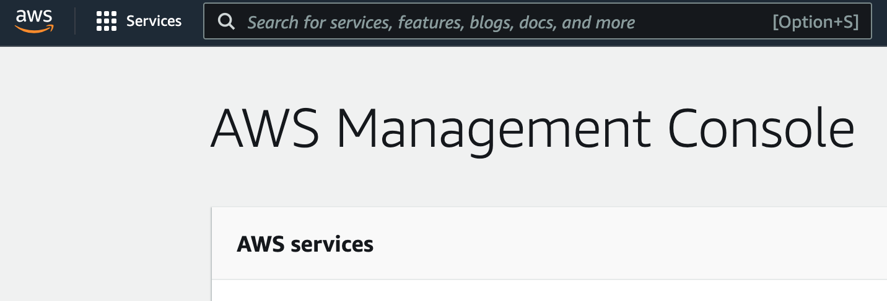

In the S3 console, click on the **sagemaker-studio-\*** bucket.

> The **sagemaker-studio-\*** bucket was created automatically when you created the SageMaker Studio domain. 

Click **Upload**.

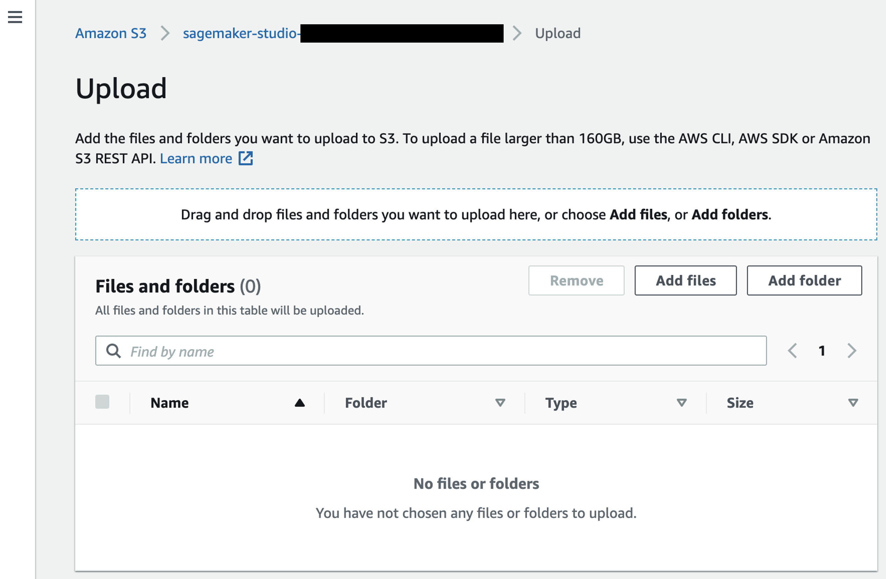

On the Upload page, drag and drop the `daily_close_price.csv` file you've just downloaded, then click **Upload** at the bottom of the page. Once the upload is complete, you can click the top-right **Close** button. You should see the file uploaded to your bucket.

## Import the dataset in Canvas

Go to the SageMaker Canvas. On the left menu, you can click the second icon to navigate to the Datasets section, then click the **Import** button.

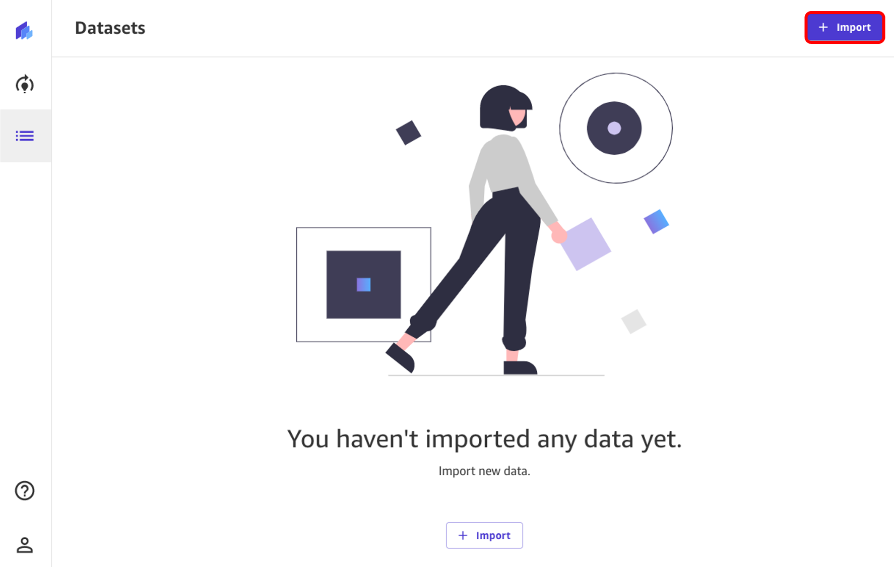

Now, select the bucket where we've previously uploaded our dataset, the **sagemaker-studio-\*** bucket.

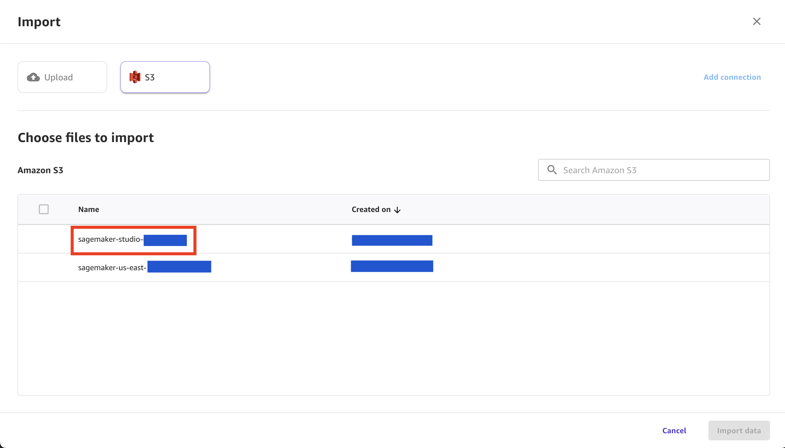

You can now select the `daily_close_price.csv` file by selecting the checkbox. Two new buttons will pop-up at the bottom of your page: **Preview all** and **Import Data**. We can choose to preview.

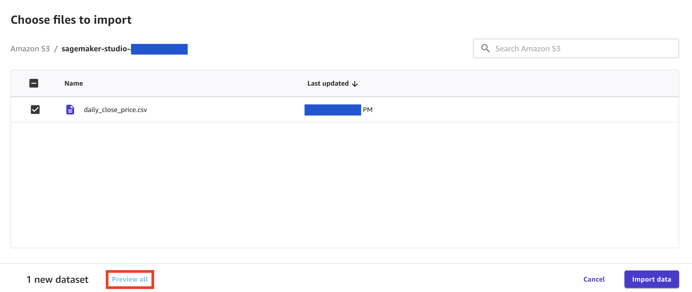

You now preview a 100-rows of the dataset you're about to import. Once you're done checking that it's indeed the right dataset, you can click on **Import Data**.

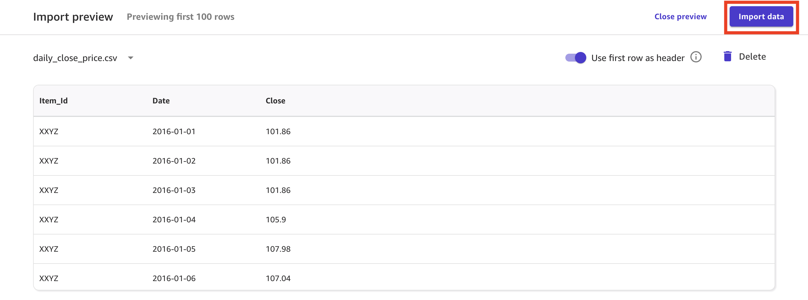

## Building and Training a ML model

Now that the dataset is imported, you can create a new model by going to the Models screen, and clicking on the **+ New Model** button.

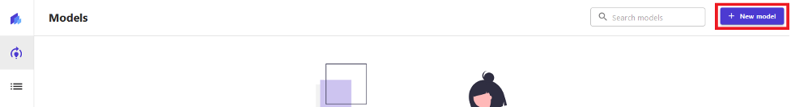

On the **Create new model** popup screen, write `store_sales_forecast_model` for the model name and click on the **Create** button.

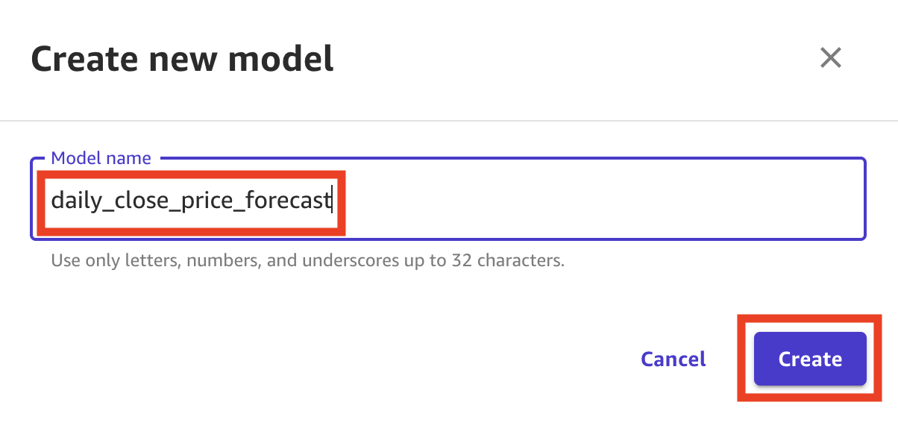

On the **Select dataset** screen, select `daily_price_close_only` for the dataset and click on the **Select dataset** button.

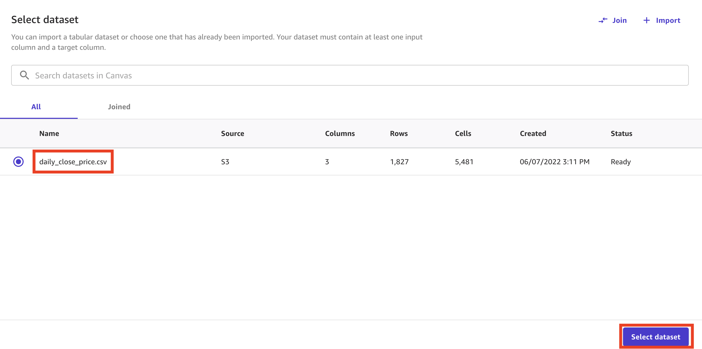

On the next screen, you can configure the model type for training. You can also select columns to see statistics of each column. Select `Close` for the **Target column** field. Canvas will automatically select **Time series forecasting** as the model type. Click on the **Configure** link.

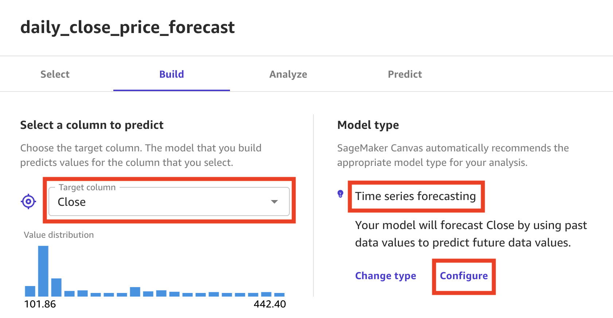

The Time Series Forecasting configuration popup screen, you are asked to provide a few information:

- The **items field**: how you identify your items in the datasets. For this use case, select `Item_Id` since we are planning to forecast price per stock symbol
- The **group column**: if you have logical groupings of the items selected above. You can choose the feature here. We don't have one for this use case, but examples group might be `NYSE`, Nasdaq, or other groupings of stock symbols as your use case desires.
- The **time stamp field**: select `Date`, which is the feature that contains the time stamp information. Canvas supports data timestamp in the format `YYYY-MM-DD` (e.g.: `2018-01-01`). You may reference other supported data formats [here](https://docs.aws.amazon.com/sagemaker/latest/dg/canvas-time-series.html).
- Write `30` in the **number of Days** field, assuming we want to forecast stock closing price 30 days into the future. 
- Select United States as the **country for holidays** field, as additional information to feed into model training. 

Finally, click on the **Save** button.

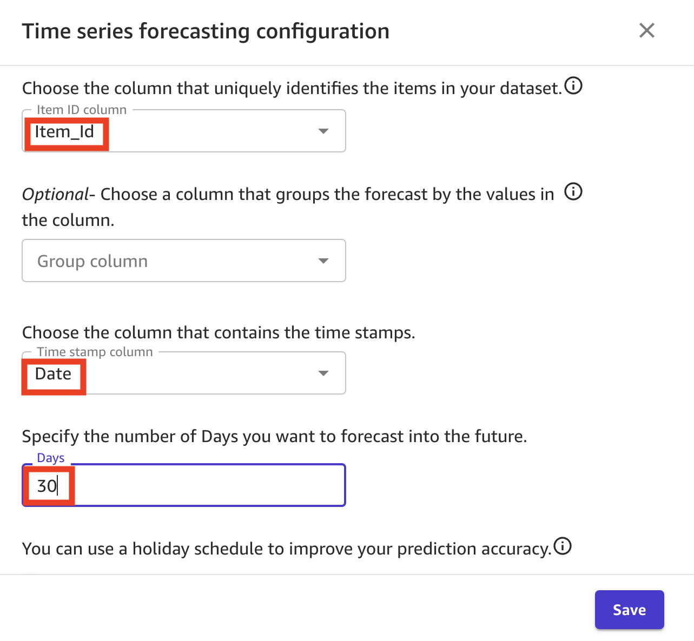

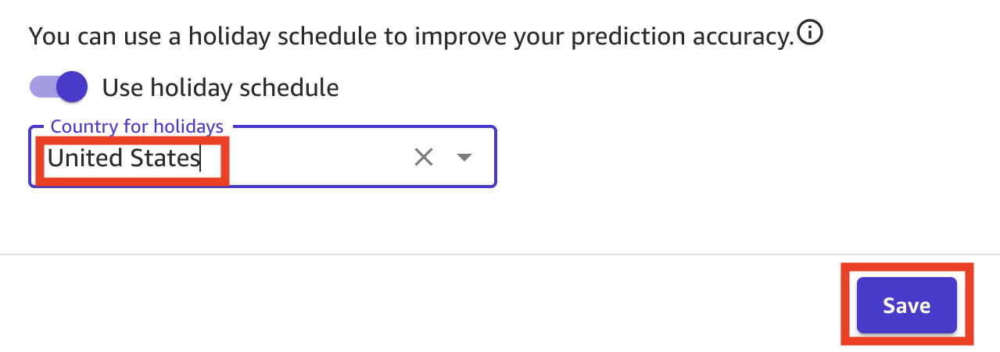

Now that the configuration is done, we're ready to train the model. Currently SageMaker Canvas does not support *Quick Build* for Time-Series Forecasting. We will select the **Standard Build** option. Model will take around 2-4 hours to train.

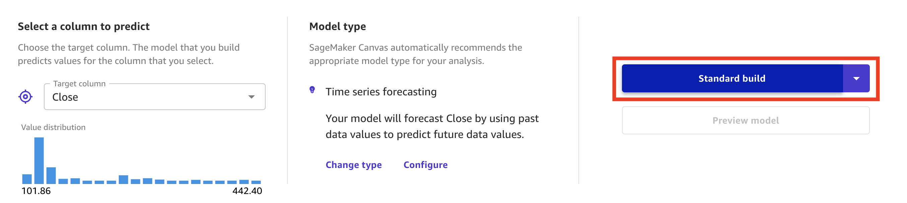

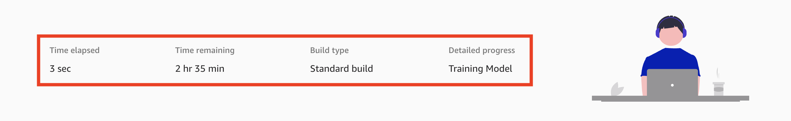

## Using the model to generate predictions

When the model training finishes, you will be routed to the **Analyze** tab. There, you can see the average prediction accuracy, and the column impact on prediction outcome. Click on the **Predict** button, and prepare to run some forecast. 

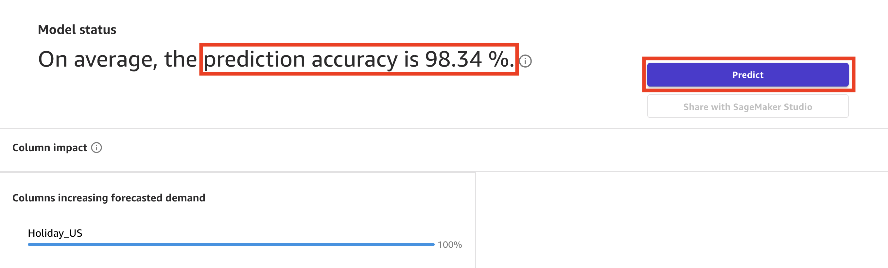

In order to create forecast predictions, you have to provide first the date range for which the forecast prediction can be made. Then, you can generate forecast predictions for all the items in the dataset or a specific item.

In our workshop, we choose the **Single item** option, and select XXYZ from the dropdown list, and Canvas generates a prediction for our item, showing the average prediction, an upper bound and a lower bound. 

For the generated forecast prediction, you can click on the **Download** dropdown menu button to download the forecast prediction chart as image or forecast prediction values as CSV file.

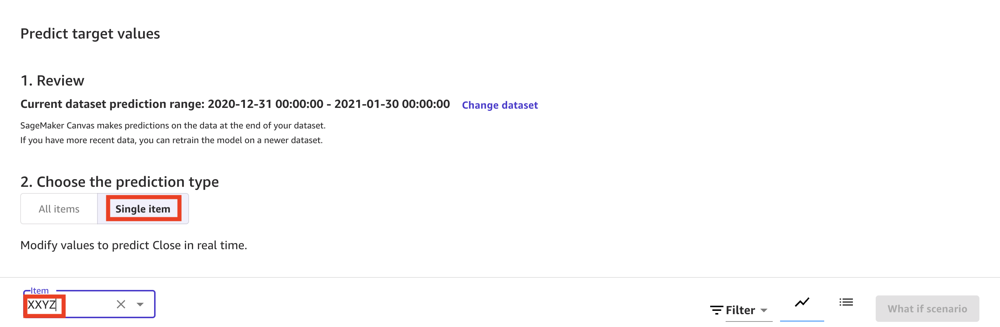

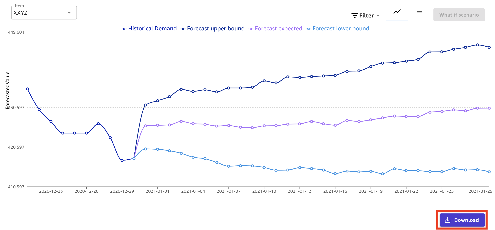

**Congratulations!** You've completed the lab to forecast stock price using SageMaker Canvas. 
